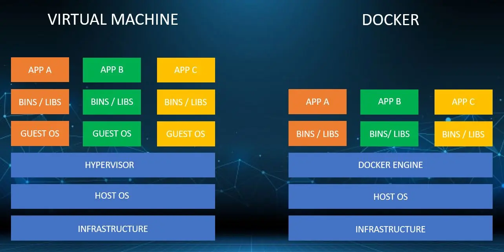

## 1. Introduction to Docker and Containerization
Docker is an open-source platform that enables developers to package applications and their dependencies into standardized units called containers.

  **Containerization** is a lightweight alternative to full machine virtualization that:

- Packages software in isolated environments
- Shares the host OS kernel
- Runs consistently across different infrastructures

**Key concepts:**

- **Images:** Read-only templates for creating containers
- **Containers:** Runnable instances of images
- **Docker Engine:** The runtime that manages containers

## 2. Benefits of Using Docker


| **Benefit**                  | **Description**                                                   |
|------------------------------|-------------------------------------------------------------------|
| **Portability**              | Runs identically on any system with Docker installed              |
| **Efficiency**               | Containers share the OS kernel, using fewer resources than VMs    |
| **Isolation**                | Applications run in separate, secure environments                 |
| **Scalability**              | Easy to scale services horizontally                               |
| **Consistency**              | Eliminates "works on my machine" problems                         |
| **Fast Deployment**          | Containers start in seconds                                       |

##3. Docker vs Virtual Machines




| **Feature**       | **Docker Containers**               | **Virtual Machines**                        |
|------------------|-------------------------------------|---------------------------------------------|
| **OS**           | Shares host OS                      | Requires full guest OS                      |
| **Startup Time** | Seconds                             | Minutes                                     |
| **Performance**  | Near-native                         | Slight overhead                             |
| **Disk Usage**   | MBs (layered images)                | GBs (full OS)                               |
| **Isolation**    | Process-level                       | Hardware-level                              |
| **Use Case**     | Microservices, CI/CD                | Legacy apps, full OS needs  


## 4. Docker Architecture

 


####  Docker System Components

- **Docker Client**: CLI interface (`docker` command) to interact with the Docker daemon.
- **Docker Host**: Runs the Docker daemon and manages containers.
- **Registry**: Central repository to store and distribute Docker images (e.g., Docker Hub, private registries).


## 5. Key Docker Components

####  Docker Core Components

| **Component**   | **Description**                                      |
|-----------------|------------------------------------------------------|
| **Docker Engine** | Core runtime (`dockerd`)                            |
| **Images**        | Immutable templates (e.g., `nginx:latest`)          |
| **Containers**    | Runnable instances of images                        |
| **Volumes**       | Persistent data storage                             |
| **Networks**      | Isolated communication channels                     |
| **Dockerfile**    | Blueprint for building images                       |
| **Docker Hub**    | Public image repository                             |


## 6. Docker CLI Commands

####  🐳 Image Management
```
docker pull nginx              # Download image
docker images                  # List images
docker rmi nginx               # Remove image
docker build -t myapp .        # Build from Dockerfile
```

####  Container Management
```
docker run -d -p 80:80 nginx   # Run container
docker ps                     # List running containers
docker stop <container_id>    # Stop container
docker rm <container_id>      # Remove container
docker exec -it nginx bash    # Enter running container
```
####  Volume Management
```
docker volume create myvol    # Create volume
docker volume ls             # List volumes
docker volume inspect myvol  # View volume details
```
####  Network Management
```
docker network create mynet   # Create network
docker network ls            # List networks
docker network inspect mynet # View network details
```


## 7. Dockerfile Syntax and Example

####  Common Instructions

| Instruction | Purpose         |
|-------------|-----------------|
| FROM        | Base image      |
| WORKDIR     | Working directory |
| COPY        | Add files       |
| RUN         | Execute commands |
| EXPOSE      | Document ports  |
| CMD         | Default command |

####  Example Dockerfile

```dockerfile
# Multi-stage build for Java app
FROM maven:3.8-jdk-11 AS build
WORKDIR /app
COPY pom.xml .
RUN mvn dependency:go-offline
COPY src/ ./src/
RUN mvn package

FROM openjdk:11-jre
WORKDIR /app
COPY --from=build /app/target/myapp.jar .
EXPOSE 8080
CMD ["java", "-jar", "myapp.jar"]
```

## 8. Kubernetes Deployment

####  Definition

Kubernetes is a container orchestration system that automates deployment, scaling, and management of containerized applications.

####  Full-Stack Example

**Backend Dockerfile (Spring Boot):**
```dockerfile
FROM maven:3.8-jdk-11 AS build
WORKDIR /app
COPY pom.xml .
RUN mvn dependency:go-offline
COPY src/ ./src/
RUN mvn package -DskipTests

FROM openjdk:11-jre
WORKDIR /app
COPY --from=build /app/target/backend.jar .
EXPOSE 8080
CMD ["java", "-jar", "backend.jar"]
```

**Frontend Dockerfile (Angular):**
```dockerfile
FROM node:16 AS build
WORKDIR /app
COPY package*.json ./
RUN npm install
COPY . .
RUN npm run build

FROM nginx:alpine
COPY --from=build /app/dist/frontend /usr/share/nginx/html
EXPOSE 80
```

**Kubernetes Deployment (k8s-deployment.yml):**
```yaml
apiVersion: apps/v1
kind: Deployment
metadata:
  name: backend
spec:
  replicas: 2
  selector:
    matchLabels:
      app: backend
  template:
    metadata:
      labels:
        app: backend
    spec:
      containers:
      - name: backend
        image: myrepo/backend:latest
        ports:
        - containerPort: 8080
        env:
        - name: DB_HOST
          value: "mysql-service"

---
apiVersion: v1
kind: Service
metadata:
  name: backend-service
spec:
  selector:
    app: backend
  ports:
  - protocol: TCP
    port: 80
    targetPort: 8080
  type: LoadBalancer

---
apiVersion: apps/v1
kind: Deployment
metadata:
  name: frontend
spec:
  replicas: 2
  selector:
    matchLabels:
      app: frontend
  template:
    metadata:
      labels:
        app: frontend
    spec:
      containers:
      - name: frontend
        image: myrepo/frontend:latest
        ports:
        - containerPort: 80

---
apiVersion: v1
kind: Service
metadata:
  name: frontend-service
spec:
  selector:
    app: frontend
  ports:
  - protocol: TCP
    port: 80
    targetPort: 80
  type: LoadBalancer

---
apiVersion: apps/v1
kind: Deployment
metadata:
  name: mysql
spec:
  selector:
    matchLabels:
      app: mysql
  template:
    metadata:
      labels:
        app: mysql
    spec:
      containers:
      - name: mysql
        image: mysql:5.7
        env:
        - name: MYSQL_ROOT_PASSWORD
          value: "password"
        ports:
        - containerPort: 3306
        volumeMounts:
        - name: mysql-persistent-storage
          mountPath: /var/lib/mysql
      volumes:
      - name: mysql-persistent-storage
        persistentVolumeClaim:
          claimName: mysql-pv-claim

---
apiVersion: v1
kind: PersistentVolumeClaim
metadata:
  name: mysql-pv-claim
spec:
  accessModes:
    - ReadWriteOnce
  resources:
    requests:
      storage: 5Gi
```


####  Service Interaction

- Frontend (Angular) makes API calls to `backend-service`
- Backend (Spring Boot) connects to `mysql-service`
- Kubernetes DNS resolves service names automatically

## 9. Docker Networking Types

| **Network Type** | **Description**         | **Use Case**                    |
|------------------|-------------------------|----------------------------------|
| Bridge           | Default network (NAT)   | Single-host communication        |
| Host             | Shares host's network   | High-performance needs           |
| Overlay          | Multi-host network      | Swarm/Kubernetes clusters        |
| Macvlan          | Assigns MAC addresses   | Legacy apps needing MAC access   |

## 10. Docker Volumes

| **Volume Type** | **Description**       | **Use Case**            |
|------------------|------------------------|--------------------------|
| Named            | Managed by Docker      | Persistent data          |
| Anonymous        | Auto-removed           | Temporary data           |
| Bind Mount       | Host directory         | Development mounts       |
| tmpfs            | Memory-only            | Sensitive temp data      |
|------------------|------------------------|--------------------------|

## 11. Docker Logs and Inspection

```bash
docker logs <container>        # View logs
docker logs -f <container>     # Follow logs in real-time
docker exec -it <container> bash  # Enter container's shell
docker inspect <container>     # Detailed container info
docker stats                   # Show live resource usage
```


## 12. Docker Security Best Practices
- Use official images from trusted sources
- Run containers as non-root user:

```dockerfile
USER appuser
```
- Scan images for vulnerabilities
- Limit container capabilities:

```bash
docker run --cap-drop=ALL --cap-add=NET_BIND_SERVICE
```
- Use secrets for sensitive data
- Keep Docker Engine and images updated


## 13. Docker in CI/CD

  Typical CI/CD Pipeline:

1. Code commit triggers build
2. Docker image is built and tested
3. Image pushed to registry
4. Kubernetes deploys new version
5. Automated rollback if tests fail


**GitHub Actions snippet:**
```yaml
- name: Build and push
  uses: docker/build-push-action@v2
  with:
    push: true
    tags: user/app:latest
```


## 14. Dockerfile Best Practices

- Use `.dockerignore` to exclude unnecessary files
- Order instructions from least to most frequently changed
- Use multi-stage builds to reduce image size
- Pin versions for base images and dependencies
- Minimize layers by combining `RUN` commands
- Use smallest suitable base image (e.g., Alpine Linux)


## 15. Cleanup Commands

```bash
docker system prune           # Remove unused objects
docker system prune -a       # Remove all unused images
docker volume prune          # Remove unused volumes
docker network prune         # Remove unused networks
docker rm $(docker ps -aq)   # Remove all stopped containers
```

## 16. Conclusion: Why Docker is Essential

Docker has become fundamental to modern DevOps because it:

- Standardizes application packaging and deployment
- Enables microservices architecture
- Facilitates CI/CD pipelines
- Improves development/production parity
- Optimizes resource utilization
- Simplifies scaling and orchestration (with Kubernetes)

When combined with Kubernetes, Docker provides a complete solution for building, shipping, and running distributed applications at scale.
