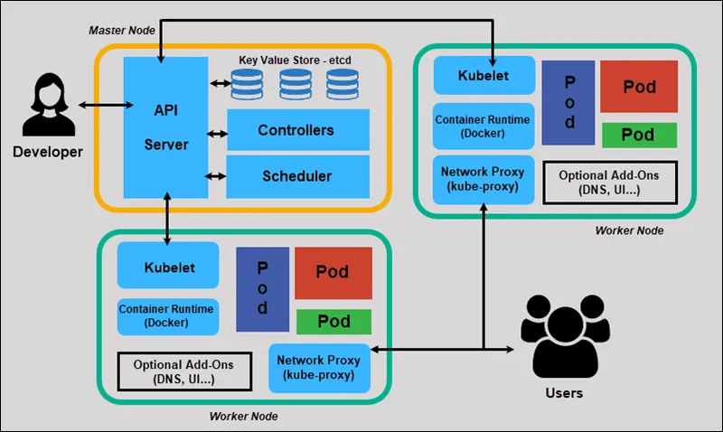
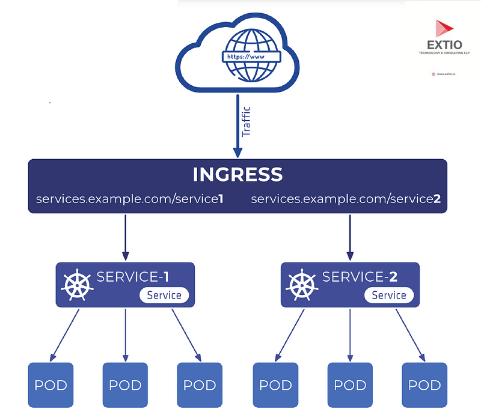

## 1. What is Kubernetes?
- Kubernetes, often abbreviated as K8s.
- It is an open-source platform designed to automate the deployment, scaling, and management of containerized applications. 
- It groups containers that make up an application into logical units for easy management and discovery.

#### Purpose of Container Orchestration
In modern software development, applications are increasingly built using containers (like Docker). While containers solve the **works on my machine** problem and provide isolation, managing many containers across multiple servers (a cluster) becomes complex. This is where container orchestration comes in:

- **Deployment Automation:** Automates the process of getting your application containers running on a cluster.

- **Scaling:** Automatically adjusts the number of container instances based on demand, ensuring performance and availability.

- **Self-Healing:** Automatically restarts failed containers, replaces unhealthy ones, and reschedules containers on healthy nodes.

- **Load Balancing:** Distributes incoming traffic across multiple container instances to ensure even load.

- **Resource Management:** Efficiently allocates compute resources (CPU, memory) to containers across the cluster.

- **Service Discovery:** Allows containers to find and communicate with each other easily.

- **Configuration Management:** Manages application configurations and sensitive data securely.
### Comparison: Docker vs Kubernetes

> It's a common misconception that Docker and Kubernetes are competing technologies. In reality, they often complement each other.

| **Feature**         | **Docker (Engine/CLI)**                                           | **Kubernetes**                                                     |
|---------------------|--------------------------------------------------------------------|---------------------------------------------------------------------|
| **Primary Role**     | Containerization platform (build, run, share containers)          | Container Orchestration (manage, scale, deploy containers)         |
| **Scope**            | Single host (primarily)                                           | Cluster of hosts (distributed systems)                             |
| **Focus**            | Packaging applications into portable units                        | Managing the lifecycle of many containers at scale                 |
| **Deployment**       | `docker run` on a single machine                                  | Automated deployment across a cluster                              |
| **Scaling**          | Manual scaling (e.g., `docker run` multiple times)               | Automatic scaling based on policies                                |
| **Self-Healing**     | Limited (e.g., restart policy)                                    | Robust (restarts, reschedules, replaces failed containers)         |
| **Networking**       | Basic networking for containers on a single host                  | Advanced networking for inter-container communication across cluster |
| **Load Balancing**   | Manual or requires external tools                                 | Built-in load balancing and service discovery                      |
| **Configuration**    | Environment variables, bind mounts                                | ConfigMaps, Secrets, Volumes                                       |
| **Complexity**       | Relatively simple for single-container apps                       | Higher initial learning curve, powerful for complex apps           |
| **Typical Usage**    | Local development, running single services                        | Production deployments of microservices, distributed apps          |

---

#### 🧠 Analogy:
> If **Docker** is the **engine** for your car (application), then **Kubernetes** is the **traffic management system** that ensures all cars on the road (applications) reach their destination efficiently and safely.

## 2. Kubernetes Architecture
Kubernetes operates on a master-worker architecture. A Kubernetes cluster consists of at least one Master Node and multiple Worker Nodes.

Diagram:



### Master Node Components

The **Master Node** (also called **Control Plane**) manages the cluster and ensures that it remains in the desired state. It includes the following components:

#### kube-apiserver

- **Purpose**: The front-end for the Kubernetes control plane. All communication with the cluster (from `kubectl` or other components) goes through the API server.
- **Role**: Exposes the Kubernetes API, handles REST operations, validates requests, and updates `etcd`.
- **Interaction**: It's the only component that directly talks to `etcd`.

#### etcd

- **Purpose**: A consistent and highly available key-value store that holds all cluster data (cluster state, configuration, metadata).
- **Role**: The single source of truth for the Kubernetes cluster.
- **Interaction**: Only the `kube-apiserver` accesses `etcd`.

#### kube-scheduler

- **Purpose**: Watches for newly created Pods that do not have an assigned node and selects a node for them to run on.
- **Role**: Considers resource requirements, hardware/software/policy constraints, affinity/anti-affinity rules, and data locality.

#### kube-controller-manager

- **Purpose**: Runs controller processes. Controllers are control loops that watch the shared state of the cluster via the API server and make changes to drive the current state towards the desired state.
- **Role**: Manages various controllers:
  - **Node Controller**: Detects and responds when nodes go down.
  - **Replication Controller**: Ensures the correct number of Pods are maintained for each ReplicaSet or ReplicationController.
  - **Endpoints Controller**: Populates the Endpoints object (connecting Services and Pods).
  - **Service Account & Token Controllers**: Creates default service accounts and API access tokens for new namespaces.

---

### Worker Node Components

**Worker Nodes** (also called **Minions** or just **Nodes**) run the actual containerized applications.

#### Kubelet

- **Purpose**: An agent that runs on

# 3. Kubernetes Core Concepts

Understanding these fundamental building blocks is crucial for working with Kubernetes.

---

#### Pod

- **Definition**: The smallest deployable unit in Kubernetes. A Pod represents a single instance of a running process in your cluster.

#### Characteristics:
- **Atomic Unit**: Can contain one or more tightly coupled containers that share the same network namespace, IP address, and storage.
- **Ephemeral**: Pods are designed to be short-lived. If a Pod dies, Kubernetes creates a new one.
- **Shared Resources**: Containers share localhost, networking stack (IP, ports), and volumes.

> **Analogy**: A Pod is like a small logical machine that hosts your app’s components.

**When to use multiple containers in a Pod?**  
Use for **sidecar containers** (e.g., logging agent, data syncer, proxy) that support the main container.

---

#### ReplicaSet

- **Definition**: Ensures a specified number of Pod replicas are running at all times.
- **Purpose**: Maintains availability and scaling. Replaces failed Pods, removes excess.
- **Usage**: Typically managed through **Deployments**, not directly created.

---

#### Deployment

- **Definition**: A higher-level abstraction for managing ReplicaSets and Pods declaratively.
- **Purpose**: Manages the desired state (e.g., number of replicas, Pod version).

#### Key Features:
- **Rolling Updates**: Update with zero downtime.
- **Rollbacks**: Revert to previous versions if needed.
- **Scaling**: Scale the number of replicas up or down.

> **Analogy**: Deployment is like a project manager for your app, ensuring correct versioning and scaling.

---

#### Service

- **Definition**: An abstraction that exposes a set of Pods as a network service.
- **Purpose**: Provides a stable IP/DNS name and acts as a load balancer.

#### Types of Services:

- **ClusterIP (default)**  
  - Internal-only access.  
  - Use for backend/internal services.

- **NodePort**  
  - Exposes service on each node’s static port.  
  - Access via `NodeIP:NodePort`.  
  - Use for testing/dev environments.

- **LoadBalancer**  
  - Externally accessible via a cloud load balancer (e.g., AWS ELB).  
  - Use for production-grade public apps.

- **ExternalName**  
  - Maps service to an external DNS name (e.g., `my.db.example.com`).  
  - No proxying — returns a CNAME record.

> **Analogy**: A Service is like a stable phone number — callers reach your app even if Pods change.

---

#### Namespace

- **Definition**: Provides a scope for resource names. Useful for isolating resources between teams or environments.
- **Purpose**: Logical partitioning of resources.

#### Default Namespaces:
- `default`: For general workloads.
- `kube-system`: Kubernetes system resources.
- `kube-public`: Public resources.
- `kube-node-lease`: Node heartbeat tracking.

**Best Practice**: Use separate Namespaces for dev, staging, production, and teams.

---

### ConfigMap & Secret

#### ConfigMap:
- **Definition**: Stores non-confidential config data as key-value pairs.
- **Purpose**: Decouple configuration from code.
- **Usage**: As environment variables, command args, or mounted files.

#### Secret:
- **Definition**: Stores sensitive data like passwords, tokens, keys.
- **Purpose**: Securely handle confidential information.
- **Security**: Base64 encoded by default. Enable encryption for production.
- **Usage**: Similar to ConfigMaps, but for secret data.

> **Best Practice**: Never store secrets in ConfigMaps.

---

### Volume & PersistentVolumeClaim (PVC)

#### Volume:
- **Definition**: A directory accessible to containers in a Pod.
- **Purpose**: Shares data between containers or persists data beyond container lifespan.

#### Basic Volume Types:
- `emptyDir`: Temporary storage, tied to Pod life.
- `hostPath`: Mounts node’s file path (not recommended in production).

#### PersistentVolume (PV):
- **Definition**: Pre-provisioned storage in the cluster.
- **Purpose**: Durable, cluster-level storage.

#### PersistentVolumeClaim (PVC):
- **Definition**: User request for PV.
- **Purpose**: Abstracts storage request from underlying storage.

> **Analogy**: PV is like a raw hard drive, PVC is the user’s storage request, and Volume is the Pod’s access point.

---

### Other Workload Resources

#### DaemonSet
- **Purpose**: Ensures a Pod runs on all (or some) nodes.
- **Use Case**: Cluster-wide agents (e.g., log collectors, metrics exporters).

#### StatefulSet
- **Purpose**: Manages stateful applications.
- **Use Case**: Databases (e.g., MySQL, Kafka) needing stable identities and storage.

#### Job
- **Purpose**: Creates Pods that run to completion.
- **Use Case**: One-off or batch tasks (e.g., report generation).

#### CronJob
- **Purpose**: Runs Jobs on a schedule (like Unix cron).
- **Use Case**: Periodic backups, scheduled reports.


## 4. Kubernetes Objects and YAML Syntax

Kubernetes resources are defined using **YAML** (`YAML Ain't Markup Language`) files. These files describe the **desired state** of objects in your cluster.

---

### Anatomy of a Kubernetes Manifest

Every Kubernetes YAML manifest generally contains **four top-level fields**:

### 1. `apiVersion`
- **What it is**: Specifies which version of the Kubernetes API you're using.
- **Examples**:
  - `v1` (for core resources like Pod, Service)
  - `apps/v1` (for Deployments, StatefulSets)
  - `batch/v1` (for Jobs, CronJobs)

### 2. `kind`
- **What it is**: The type of Kubernetes object being created.
- **Examples**: `Pod`, `Deployment`, `Service`, `ConfigMap`, `PersistentVolumeClaim`

### 3. `metadata`
- **What it contains**:
  - `name`: Unique name of the object within a Namespace.
  - `namespace`: (Optional) Scope of the resource. Defaults to `default` if not specified.
  - `labels`: Key-value pairs used for organization and selection.
  - `annotations`: Additional metadata (non-identifying, like build version or tool info).

### 4. `spec`
- **What it is**: Defines the **desired state** of the object.
- **Note**: The structure under `spec` depends on the object's `kind`.

---

### Example Basic YAML Structure

```yaml
apiVersion: <api-version>
kind: <kind-of-object>
metadata:
  name: <object-name>
  namespace: <optional-namespace>
  labels:
    app: <application-name>
    tier: <tier-name>
spec:
  # Desired state of the object (varies by kind)
```

### Example YAML Files

These YAML files define various Kubernetes resources like Pods, Deployments, Services, ConfigMaps, and PVCs.

---

#### 🧱 Pod Example

```yaml
# my-pod.yaml
apiVersion: v1
kind: Pod
metadata:
  name: my-nginx-pod
  labels:
    app: web
    tier: frontend
spec:
  containers:
    - name: nginx-container
      image: nginx:latest
      ports:
        - containerPort: 80
```

Deployment Example

```yaml
# my-deployment.yaml
apiVersion: apps/v1
kind: Deployment
metadata:
  name: my-web-deployment
  labels:
    app: web
spec:
  replicas: 3 # Desired number of Pod replicas
  selector:
    matchLabels:
      app: web # Selects Pods with label app: web
  template: # Pod template
    metadata:
      labels:
        app: web
        version: v1.0.0
    spec:
      containers:
      - name: nginx-container
        image: nginx:1.21.6
        ports:
        - containerPort: 80
        resources: # Optional: Define resource requests and limits
          requests:
            memory: "64Mi"
            cpu: "250m" # 0.25 CPU core
          limits:
            memory: "128Mi"
            cpu: "500m" # 0.5 CPU core
```

Service Example (NodePort)

```yaml
# my-service.yaml
apiVersion: v1
kind: Service
metadata:
  name: my-web-service
  labels:
    app: web
spec:
  selector:
    app: web # Selects Pods with label app: web
  type: NodePort # Exposes service on a static port on each node
  ports:
    - protocol: TCP
      port: 80 # Service port (internal)
      targetPort: 80 # Container port
      nodePort: 30007 # Optional: Specific node port (range 30000-32767)
```

ConfigMap Example

```yaml
# my-configmap.yaml
apiVersion: v1
kind: ConfigMap
metadata:
  name: app-config
data:
  # Key-value pairs for configuration
  APP_COLOR: blue
  APP_ENV: development
  database.url: jdbc:mysql://localhost:3306/mydb

```

PersistentVolumeClaim (PVC) Example

```yaml
# my-pvc.yaml
apiVersion: v1
kind: PersistentVolumeClaim
metadata:
  name: my-data-pvc
spec:
  accessModes:
    - ReadWriteOnce # Can be mounted as read-write by a single node
  resources:
    requests:
      storage: 5Gi # Request 5 Gigabytes of storage
  # storageClassName: standard # Optional: If you have a specific StorageClass
```


## 5. Kubernetes CLI (kubectl)

- `kubectl` is the **command-line tool** for interacting with Kubernetes clusters.

---

#### 🔌 Cluster Interaction

- `kubectl` communicates with the **kube-apiserver** on the **Control Plane** (Master Node).

---

#### 🛠️ Common `kubectl` Commands (Grouped by Function)

#### ✅ Creation & Application

**Apply a configuration (create or update):**

```bash
kubectl apply -f <filename.yaml>
kubectl apply -f <directory_containing_yamls>/
# Example:
kubectl apply -f my-deployment.yaml
```

**Best Practice:**
 Always use kubectl apply for managing resources, as it's idempotent (can be run multiple times safely).

---

Create a resource (if it doesn't exist):

```Bash

kubectl create -f <filename.yaml> # Creates only if resource doesn't exist
kubectl create deployment my-app --image=nginx # Quick imperitive command
```

> **Note:**  
> `kubectl create` is generally used for **initial setup** or **one-off resources**.  
> `kubectl apply` is preferred for **declarative, version-controlled resource management**.

---

#### 🔍 Getting Information

#### List resources:
```bash

kubectl get pods
kubectl get deployments
kubectl get services
kubectl get all # Get common resources (pods, services, deployments, replicasets)
kubectl get pods -o wide # Show more details (Node IP, Pod IP)
kubectl get pods -n <namespace> # Get pods in a specific namespace
kubectl get pods --show-labels # Show labels
```
#### Describe a resource (detailed information):

```bash

kubectl describe pod <pod-name>
kubectl describe deployment <deployment-name>
kubectl describe service <service-name>
# Example:
kubectl describe pod my-nginx-pod-abc12
```

> **Purpose:** Shows events, status, resource limits, volumes, etc. Indispensable for     troubleshooting.

---
#### View logs from a container in a Pod:

```Bash

kubectl logs <pod-name>
kubectl logs -f <pod-name> # Follow logs in real-time
kubectl logs <pod-name> -c <container-name> # For multi-container pods
```
#### Execute a command in a running container:

```Bash
kubectl exec -it <pod-name> -- /bin/bash # Get a shell into the container
kubectl exec <pod-name> -- ls /app # Run a command
# Example:
kubectl exec -it my-nginx-pod-abc12 -- bash
```
#### Copy files to/from a container:

```Bash
kubectl cp <source-path> <pod-name>:<destination-path>
kubectl cp <pod-name>:<source-path> <destination-path>
# Example:
kubectl cp my-local-file.txt my-nginx-pod-abc12:/usr/share/nginx/html/
```
#### View resource usage (requires Metrics Server):

```Bash
kubectl top nodes
kubectl top pods
```
#### Check cluster events:

```Bash
kubectl get events
```
##### Deletion:
> Delete a resource:

```Bash
kubectl delete -f <filename.yaml>
kubectl delete pod <pod-name>
kubectl delete deployment <deployment-name>
kubectl delete service <service-name>
kubectl delete namespace <namespace-name> # Deletes everything in that namespace
# Example:
kubectl delete -f my-deployment.yaml
kubectl delete deployment my-web-deployment
```

### Scaling and Updates:
> Scale a Deployment:

```Bash
kubectl scale deployment <deployment-name> --replicas=<number>
# Example:
kubectl scale deployment my-web-deployment --replicas=5
```

> Rollout status/history/undo:

```Bash
kubectl rollout status deployment/<deployment-name>
kubectl rollout history deployment/<deployment-name>
kubectl rollout undo deployment/<deployment-name> # Rollback to previous version
```
#### Namespace Management:
> List namespaces:
```Bash
kubectl get namespaces
```
> Create a namespace:
```Bash
kubectl create namespace <namespace-name>
# Example: kubectl create namespace dev-env
```
> Set default namespace for current context:
```Bash
kubectl config set-context --current --namespace=<namespace-name>
# Example: kubectl config set-context --current --namespace=dev-env
```
 This makes your infrastructure version-controllable and repeatable.

#### Best Practices for `kubectl`

> **Declarative vs. Imperative**: While imperative commands (`kubectl run`, `kubectl create deployment`) are useful 
  for quick tests, **prefer declarative management** using YAML files with:  
 
 ```
  kubectl apply -f <file.yaml>
 ```
 ---
 - This makes your infrastructure version-controllable and repeatable.

#### 📛 Namespaces

- Always specify the namespace using the `-n <namespace>` flag if you're not operating in the default namespace.
  
  ```bash
  kubectl get pods -n dev
  ```
#### 🏷️ Labels
Use **labels** extensively for organizing and selecting Kubernetes resources.

- Labels are key-value pairs used to categorize resources.
- They enable filtering, selection, and grouping for operations like deployments, services, and monitoring.

**Example (YAML):**
```yaml
metadata:
  labels:
    app: my-app
    environment: dev
```
### 🛠️ Describe for Troubleshooting

When something isn't working, `kubectl describe` should be your **first stop**.

- It provides detailed insights into the resource's current state.
- Useful information includes:
  - Events and warnings
  - Pod scheduling and status
  - Liveness/readiness probe results
  - Volume mounts and conditions

**Example:**
```bash
kubectl describe pod my-app-pod
```
### 📄 Logs for Application Insights

Use `kubectl logs` to **check logs and understand application behavior**.

**Examples:**
```bash
kubectl logs <pod-name>
kubectl logs -f <pod-name>              # Follow logs in real time
kubectl logs <pod-name> -c <container>  # For multi-container Pods
```
## 6. Kubernetes Networking
Kubernetes networking enables communication between Pods, Services, and the outside world. It's a complex topic, but here's a simplified overview.

#### Key Principles:
- Every Pod gets its own unique IP address.
- Pods on a node can communicate with all Pods on all other nodes without NAT.
- Agents on a node (e.g., kubelet) can communicate with all Pods on that node.

#### Pod-to-Pod Communication
- **When Pods are on the same Node**: They communicate directly using their Pod IP addresses.
- **When Pods are on different Nodes**: Traffic is routed between nodes by the underlying Container Network Interface (CNI) plugin (e.g., Calico, Flannel, Weave Net). Each Pod has a unique IP address within the cluster, and these IPs are routable across the cluster.

#### Service-to-Service Communication
- Services provide a stable IP address and DNS name for a set of Pods.
- Pods communicate with each other via Services using the Service's stable IP address or DNS name.
- `kube-proxy` on each node ensures that traffic sent to a Service's IP is correctly load-balanced to the healthy Pods backing that Service.

**Example**: A frontend Pod wants to talk to a backend Pod. Instead of knowing the backend Pod's ephemeral IP, it sends traffic to the backend-service name or IP, and Kubernetes handles the routing and load balancing.

#### DNS Resolution
- Kubernetes provides internal DNS resolution.
- Services are automatically assigned DNS names.
  - **Within the same Namespace**: `service-name`
  - **Across Namespaces**: `service-name.namespace-name.svc.cluster.local`
- This allows Pods to discover and communicate with Services by name rather than by IP address.

#### Network Policies (Basic Intro)
- **Definition**: Kubernetes Network Policies specify how groups of Pods are allowed to communicate with each other and with external network endpoints.
- **Purpose**: Enhance security by restricting network access between Pods. By default, Pods are non-isolated and can accept traffic from any source.
- **Requirement**: Network Policies require a CNI plugin that supports them (e.g., Calico, Cilium).

**Analogy**: Network Policies are like firewall rules for your Pods.

---

## 7. Kubernetes Storage
Kubernetes provides robust mechanisms for managing storage, allowing applications to persist data beyond the life of a single container or Pod.

#### Types of Volumes
Kubernetes Volumes are directories accessible to the containers in a Pod. The data in a Volume persists as long as the Pod exists. Some common types:

##### `emptyDir`:
- **Purpose**: A simple, empty volume created when a Pod is first assigned to a node.
- **Persistence**: Its contents are deleted when the Pod is removed from the node.
- **Use Case**: Temporary scratch space, sharing files between containers in the same Pod.

##### `hostPath`:
- **Purpose**: Mounts a file or directory from the host node's filesystem into a Pod.
- **Persistence**: Data persists beyond Pod lifecycle, but tied to a specific node.
- **Use Case**: Primarily for system-level Pods (e.g., monitoring agents), or if you need access to host files.

**Caution**: Generally discouraged for production applications due to lack of portability and potential security risks.

##### `persistentVolume (PV)` and `persistentVolumeClaim (PVC)`: (Covered in Section 3)
- **PV**: A piece of storage in the cluster, provisioned by an admin (or dynamically).
- **PVC**: A request for storage by a user, that binds to an available PV.
- **Purpose**: Provides a way to consume durable storage abstractly.
- **Use Case**: Databases, persistent application data.

#### StorageClasses (Basic Overview)
- **Definition**: An API object that describes the "classes" of storage offered in a cluster.
- **Purpose**: Allows administrators to define different types of storage (e.g., "fast-SSD", "cheap-HDD", "network-storage") and users to request them without knowing the underlying storage details.
- **Dynamic Provisioning**: When a PVC requests a `storageClassName`, the StorageClass can dynamically provision a matching PV for that PVC.

**Analogy**: StorageClass is like a catalog of storage options, and PVC is like ordering from that catalog.

---

## 8. Kubernetes Services Comparison Table
Here's a comparison of the main Service types in Kubernetes, including Ingress for external access.

| Feature       | ClusterIP               | NodePort                             | LoadBalancer                        | Ingress                                                                 |
|---------------|--------------------------|---------------------------------------|-------------------------------------|-------------------------------------------------------------------------|
| **Exposure**  | Internal to cluster      | On each Node's IP at a static port    | External IP provisioned by cloud provider | HTTP/HTTPS routing based on host/path                      |
| **Accessibility** | Only from within the cluster | From outside the cluster (via NodeIP:NodePort) | From anywhere on the internet | From anywhere on the internet (via DNS of Ingress controller) |
| **Load Balancing** | Internal (`kube-proxy`) | Internal (`kube-proxy`) | External (cloud provider's LB) | Application-layer (L7) (Ingress controller) |
| **Cost**      | Free                    | Free                                  | Varies by cloud provider (often charged) | Requires Ingress Controller (potentially charged for underlying LB) |
| **Complexity**| Low                     | Low                                   | Moderate (requires cloud provider setup) | Moderate to High (requires Ingress Controller setup) |
| **Use Cases** | Internal microservices, backend services | Demo/testing, non-production apps, exposing a few services | Production apps in cloud, public APIs | Production web apps (HTTP/HTTPS), multiple services on single IP, SSL termination |
| **DNS**       | Internal DNS name        | Internal DNS name + NodeIP/NodePort   | External IP + Internal DNS name     | External DNS name (for Ingress Host) |

---

## 9. Kubernetes Ingress
While Services expose applications, Ingress is designed for managing external access to services in a cluster, typically HTTP and HTTPS.

#### Ingress Controller and Ingress Resource

##### Ingress Controller:
- **Definition**: An application that runs in your cluster and watches the Kubernetes API for Ingress resources.
- **Purpose**: Fulfills the Ingress rules by acting as a reverse proxy/load balancer. Common Ingress Controllers include Nginx Ingress Controller, Traefik, Istio, GKE Ingress, AWS ALB Ingress Controller.
- **Deployment**: The Ingress Controller itself is typically deployed as a Deployment and exposed via a NodePort or LoadBalancer Service.

##### Ingress Resource:
- **Definition**: A Kubernetes API object that defines rules for routing external HTTP/HTTPS traffic to Services within the cluster.
- **Purpose**: Provides flexible routing based on hostname, path, and TLS termination.

**Analogy**: The Ingress Controller is the actual traffic cop, and the Ingress Resource is the rulebook that tells the traffic cop how to direct traffic.

Ingress Architecture:


#### Basic Ingress YAML Example

This example routes traffic for `myapp.example.com/api` to `api-service` and `myapp.example.com/` to `frontend-service`.

```yaml
#### my-ingress.yaml
apiVersion: networking.k8s.io/v1
kind: Ingress
metadata:
  name: my-app-ingress
  annotations:
    # Example annotation for Nginx Ingress Controller:
    nginx.ingress.kubernetes.io/rewrite-target: /
spec:
  rules:
  - host: myapp.example.com
    http:
      paths:
      - path: /api
        pathType: Prefix
        backend:
          service:
            name: api-service # Name of your API Service
            port:
              number: 8080
      - path: /
        pathType: Prefix
        backend:
          service:
            name: frontend-service # Name of your Frontend Service
            port:
              number: 80
  # Optional: TLS/SSL termination
  # tls:
  #   - hosts:
  #       - myapp.example.com
  #     secretName: my-app-tls-secret # Secret containing TLS certificate and key
```
> **Note:** You must have an Ingress Controller running in your cluster for Ingress resources to work.

## 10. Helm Basics

**Helm** is a package manager for Kubernetes. It simplifies the deployment and management of applications on Kubernetes clusters.

### What is Helm?

- **Definition**: The "apt/yum/brew" for Kubernetes.
- **Purpose**: Helps you define, install, and upgrade even the most complex Kubernetes applications.

### Key Concepts:

- **Charts**: Pre-configured Kubernetes resource packages.
- **Repositories**: Places where charts are stored and shared.
- **Releases**: An instance of a chart running in a Kubernetes cluster.

---

### Helm Charts and their Structure

A **Helm Chart** is a collection of files that describe a related set of Kubernetes resources. Think of it as a template for a Kubernetes application.

**Typical Chart Structure:**
#### Helm Chart Structure: `my-app-chart/`

```text
my-app-chart/
├── Chart.yaml          # A YAML file containing information about the chart (name, version, etc.)
├── values.yaml         # Default configuration values for the chart
├── templates/          # Directory containing Kubernetes manifest templates
│   ├── deployment.yaml # Template for a Deployment object
│   ├── service.yaml    # Template for a Service object
│   ├── _helpers.tpl    # Optional: Contains reusable template snippets
│   └── NOTES.txt       # Optional: Instructions for the user after installation
├── charts/             # Optional: Contains dependent charts (subcharts)
└── README.md           # Optional: A brief description of the chart
```

Installing and Using Helm Commands
Install Helm CLI:

macOS (Homebrew): brew install helm

Linux: Download from helm.sh or use package manager.

Add a Chart Repository (e.g., Bitnami stable charts):

```Bash

helm repo add bitnami https://charts.bitnami.com/bitnami
helm repo update # Update information about charts from all repositories
```
>Search for Charts:

```Bash
helm search repo nginx
```
>Install a Chart:

```Bash

helm install <release-name> <chart-name> --namespace <namespace> --values <your-values.yaml>
# Example: Install Nginx Ingress Controller
helm install my-nginx-ingress bitnami/nginx-ingress-controller --namespace ingress-nginx
# Example: Install WordPress
helm install my-wordpress bitnami/wordpress --set mysql.rootPassword=mysecretpassword --namespace blog
--set: Override specific values from values.yaml directly on the command line.

--values: Provide an entire custom values.yaml file.
```
>List Releases:

```Bash

helm list
helm list -n <namespace>
```
>Upgrade a Release:

```Bash

helm upgrade <release-name> <chart-name> --namespace <namespace> --values <your-new-values.yaml>
# Example:
helm upgrade my-wordpress bitnami/wordpress -f my-new-wordpress-values.yaml
```
>Uninstall a Release:

```Bash

helm uninstall <release-name> --namespace <namespace>
# Example:
helm uninstall my-wordpress -n blog
```
>Get Release Status:

```Bash
helm status <release-name> -n <namespace>
```
>Lint a Chart (check for best practices and syntax errors):
```Bash
helm lint ./my-app-chart
```
Package a Chart:
```Bash
helm package ./my-app-chart
```
## 11. Kubernetes Security Basics
Security is paramount in Kubernetes. Here are fundamental concepts.

Role-Based Access Control (RBAC)  
Purpose: Authorizes users and applications to interact with the Kubernetes API.

Concepts:

- Role: Defines a set of permissions within a specific Namespace (e.g., "can read Pods" or "can manage Deployments").

- ClusterRole: Similar to a Role, but applies across the entire cluster (non-namespaced resources like Nodes or PersistentVolumes, or namespaced resources across all Namespaces).

- RoleBinding: Grants the permissions defined in a Role to a user, group, or ServiceAccount within a specific Namespace.

- ClusterRoleBinding: Grants the permissions defined in a ClusterRole to a user, group, or ServiceAccount across the entire cluster.

Analogy: RBAC is like defining roles in an organization (e.g., "Manager," "Developer") and then assigning those roles to specific people or teams.

ServiceAccount  
Definition: Provides an identity for processes that run in a Pod.

Purpose: Allows Pods to authenticate to the Kubernetes API server when they need to perform actions (e.g., a controller that watches for new resources).

Default: Every Pod automatically gets a default ServiceAccount in its Namespace, which usually has limited permissions.

Best Practice: Create specific ServiceAccounts with the minimal necessary permissions for your applications.

Network Policies  
Purpose: (As discussed in Section 6) Control Pod-to-Pod communication using firewall rules. By default, Pods are open. Network Policies allow you to isolate them.

Best Practice: Implement Network Policies to restrict traffic flows to only what is necessary, following the principle of least privilege.

Secrets and ConfigMaps (Best Practices)  
Secrets: (As discussed in Section 3) For sensitive data.

Best Practice: Always use Secrets for credentials. Do not store sensitive data in ConfigMaps or directly in YAML files in version control.

For production, consider external Secret management solutions (e.g., HashiCorp Vault, cloud provider KMS integrations) to avoid storing plaintext secrets in etcd or in your Kubernetes manifests.

ConfigMaps: For non-confidential configuration.

Best Practice: Use ConfigMaps to decouple configuration from your application images.

## 12. Monitoring and Logging  
Effective monitoring and logging are crucial for understanding the health and performance of your Kubernetes applications and cluster.

Basic Health Checks  
- **Liveness Probes**: (See Section 14) Determine if a container is running and healthy. If a Liveness Probe fails, Kubernetes restarts the container.

- **Readiness Probes**: (See Section 14) Determine if a container is ready to serve traffic. If a Readiness Probe fails, the Pod is removed from Service load balancing until it becomes ready.

kubectl logs and kubectl top  
- **kubectl logs**: (As discussed in Section 5) Retrieve standard output and standard error from containers. Essential for debugging application issues.

- **kubectl top**: (As discussed in Section 5) Provides basic CPU and memory usage of nodes and pods. Requires the Kubernetes Metrics Server to be installed in the cluster.

Prometheus and Grafana Overview  
These are de-facto standards for monitoring in Kubernetes environments.

**Prometheus**:

- **Purpose**: A powerful open-source monitoring and alerting toolkit designed for reliability and scalability.

- **How it works**: Scrapes metrics from configured targets (Kubernetes components, application endpoints) at regular intervals, stores them, and allows for querying and alerting.

**Grafana**:

- **Purpose**: An open-source analytics and interactive visualization web application.

- **How it works**: Used to create dashboards that visualize data collected by Prometheus (or other data sources). Provides powerful querying and visualization capabilities.

Typical Setup:

- Prometheus Server (runs in Kubernetes) scrapes metrics.

- Grafana (runs in Kubernetes) connects to Prometheus as a data source and displays dashboards.

- Node Exporter (DaemonSet) on each node exposes node-level metrics for Prometheus.

- kube-state-metrics (Deployment) exposes Kubernetes object metrics (e.g., Pod status, Deployment replicas).

## 13. Deploying a Full-Stack App (Spring Boot + Angular + MySQL)
#### Full-Stack Application Architecture
#### Application Components

- **Frontend**: Angular application served by Nginx
- **Backend**: Spring Boot REST API
- **Database**: MySQL
#### Kubernetes Application Architecture

```plaintext
        User
         |
         V
+---------------------+
|  Internet / Browser |
+---------------------+
         | (HTTP/HTTPS)
         V
+---------------------+
| Ingress Controller  |
+---------------------+
         |
         |--> Host: `myapp.com/api` → Spring Boot Service
         |--> Host: `myapp.com/`   → Angular Service
         V
+-----------------------------------+
|     Kubernetes Cluster            |
|                                   |
|  +---------------------------+   |
|  |   Frontend Service        |   |
|  | (ClusterIP)               |   |
|  +----+----------------------+   |
|       |                          |
|       V                          |
|  +---------------------------+   |
|  |   Frontend Deployment     |   |
|  |   (Nginx + Angular)       |   |
|  +---------------------------+   |
|                                   |
|  +---------------------------+   |
|  |   Backend Service         |   |
|  | (ClusterIP)               |   |
|  +----+----------------------+   |
|       |                          |
|       V                          |
|  +---------------------------+   |
|  |   Backend Deployment      |   |
|  |   (Spring Boot)           |   |
|  +----+----------------------+   |
|       |                          |
|       V                          |
|  +---------------------------+   |
|  |   MySQL Service           |   |
|  | (ClusterIP)               |   |
|  +----+----------------------+   |
|       |                          |
|       V                          |
|  +---------------------------+   |
|  |   MySQL StatefulSet       |   |
|  |   + PVC for Data          |   |
|  +---------------------------+   |
+-----------------------------------+
```
YAML Manifests:

We'll use a single k8s-fullstack.yaml file for simplicity.

#### k8s-fullstack.yaml
---
#### 1. MySQL Deployment (using StatefulSet for persistence)

```yaml
apiVersion: apps/v1
kind: StatefulSet
metadata:
  name: mysql
  labels:
    app: mysql
spec:
  selector:
    matchLabels:
      app: mysql
  serviceName: "mysql" # headless service for stable network identity
  replicas: 1
  template:
    metadata:
      labels:
        app: mysql
    spec:
      containers:
      - name: mysql
        image: mysql:8.0
        env:
        - name: MYSQL_ROOT_PASSWORD
          valueFrom:
            secretKeyRef:
              name: mysql-secret
              key: mysql-root-password
        - name: MYSQL_DATABASE
          valueFrom:
            configMapKeyRef:
              name: app-config
              key: MYSQL_DATABASE
        ports:
        - containerPort: 3306
          name: mysql
        volumeMounts:
        - name: mysql-data # Mount the volume for persistent data
          mountPath: /var/lib/mysql
  volumeClaimTemplates: # Define the PVC for this StatefulSet
  - metadata:
      name: mysql-data
    spec:
      accessModes: [ "ReadWriteOnce" ]
      resources:
        requests:
          storage: 5Gi # Request 5GB of storage
      # storageClassName: standard # Uncomment if you have a specific StorageClass
```
---
#### 2. MySQL Service (ClusterIP, for internal communication)
```yaml
apiVersion: v1
kind: Service
metadata:
  name: mysql-service
  labels:
    app: mysql
spec:
  ports:
  - port: 3306
    targetPort: 3306
    protocol: TCP
    name: mysql
  selector:
    app: mysql
  clusterIP: None # Headless service for StatefulSet
```
---
#### 3. Spring Boot Backend Deployment
```yaml
apiVersion: apps/v1
kind: Deployment
metadata:
  name: spring-boot-backend
  labels:
    app: backend
spec:
  replicas: 2
  selector:
    matchLabels:
      app: backend
  template:
    metadata:
      labels:
        app: backend
    spec:
      containers:
      - name: spring-boot-app
        image: yourusername/spring-boot-app:1.0.0 # Replace with your image!
        env:
        - name: SPRING_DATASOURCE_URL
          valueFrom:
            configMapKeyRef:
              name: app-config
              key: SPRING_DATASOURCE_URL
        - name: SPRING_DATASOURCE_USERNAME
          valueFrom:
            secretKeyRef:
              name: mysql-secret
              key: mysql-username
        - name: SPRING_DATASOURCE_PASSWORD
          valueFrom:
            secretKeyRef:
              name: mysql-secret
              key: mysql-password
        ports:
        - containerPort: 8080
        livenessProbe: # Example liveness probe
          httpGet:
            path: /actuator/health/liveness # Adjust path for your Spring Boot app
            port: 8080
          initialDelaySeconds: 30
          periodSeconds: 10
        readinessProbe: # Example readiness probe
          httpGet:
            path: /actuator/health/readiness # Adjust path
            port: 8080
          initialDelaySeconds: 15
          periodSeconds: 5

```
---
#### 4. Spring Boot Backend Service (ClusterIP, for internal and Ingress access)
```yaml
apiVersion: v1
kind: Service
metadata:
  name: backend-service
  labels:
    app: backend
spec:
  selector:
    app: backend
  ports:
  - protocol: TCP
    port: 8080
    targetPort: 8080
  type: ClusterIP
```
---
#### 5. Angular Frontend Deployment
```yaml
apiVersion: apps/v1
kind: Deployment
metadata:
  name: angular-frontend
  labels:
    app: frontend
spec:
  replicas: 2
  selector:
    matchLabels:
      app: frontend
  template:
    metadata:
      labels:
        app: frontend
    spec:
      containers:
      - name: nginx-angular
        image: yourusername/angular-nginx:1.0.0 # Replace with your image!
        ports:
        - containerPort: 80
```
---
#### 6. Angular Frontend Service (ClusterIP, for Ingress access)
```yaml
apiVersion: v1
kind: Service
metadata:
  name: frontend-service
  labels:
    app: frontend
spec:
  selector:
    app: frontend
  ports:
  - protocol: TCP
    port: 80
    targetPort: 80
  type: ClusterIP
```
---
#### 7. ConfigMap for application configuration
```yaml
apiVersion: v1
kind: ConfigMap
metadata:
  name: app-config
data:
  MYSQL_DATABASE: myappdb
  SPRING_DATASOURCE_URL: jdbc:mysql://mysql-service:3306/myappdb?useSSL=false&allowPublicKeyRetrieval=true
```
---
#### 8. Secret for sensitive data (base64 encoded)
```yaml
# Create secrets first:
# echo -n 'root_password_here' | base64
# echo -n 'myuser' | base64
# echo -n 'mypassword' | base64
apiVersion: v1
kind: Secret
metadata:
  name: mysql-secret
type: Opaque
data:
  mysql-root-password: <base64_encoded_root_password> # e.g., cG9zdGdyZXNfcGFzc3dvcmRfaGVyZQ==
  mysql-username: <base64_encoded_db_username>
  mysql-password: <base64_encoded_db_password>
```
---
#### 9. Ingress for external routing
```yaml
apiVersion: networking.k8s.io/v1
kind: Ingress
metadata:
  name: my-app-ingress
  annotations:
    # Use appropriate annotations for your Ingress Controller (e.g., Nginx, AWS ALB)
    # For Nginx Ingress Controller:
    nginx.ingress.kubernetes.io/rewrite-target: /$2 # For path stripping if needed
    nginx.ingress.kubernetes.io/ssl-redirect: "false" # Optional, if not using HTTPS
spec:
  ingressClassName: nginx # Required for Kubernetes v1.18+
  rules:
  - host: myapp.example.com # Replace with your domain
    http:
      paths:
      - path: /api(/|$)(.*) # Route traffic for /api to backend
        pathType: Prefix
        backend:
          service:
            name: backend-service
            port:
              number: 8080
      - path: /(.*) # Route all other traffic to frontend
        pathType: Prefix
        backend:
          service:
            name: frontend-service
            port:
              number: 80
  # Uncomment and configure TLS if you have a certificate secret
  # tls:
  #   - hosts:
  #       - myapp.example.com
  #     secretName: myapp-tls-secret # Create this secret with 'kubectl create secret tls myapp-tls-secret --key private.key --cert certificate.crt'
```

Deployment Steps:
Build and push your Docker images:
```bash
docker build -t yourusername/spring-boot-app:1.0.0 ./spring-boot-app
docker push yourusername/spring-boot-app:1.0.0
docker build -t yourusername/angular-nginx:1.0.0 ./angular-nginx
docker push yourusername/angular-nginx:1.0.0
```
Create your mysql-secret:

```Bash
kubectl create secret generic mysql-secret \
  --from-literal=mysql-root-password='your_root_password' \
  --from-literal=mysql-username='myuser' \
  --from-literal=mysql-password='mypassword'
```
Apply the full-stack YAML:
```bash

kubectl apply -f k8s-fullstack.yaml
```
Verify Deployments and Services:
```Bash
kubectl get deployments
kubectl get pods
kubectl get services
kubectl get pvc
kubectl get ingress
```
>Access the application:

If using a cloud provider, the LoadBalancer for your Ingress Controller will get an external IP.
Update your DNS A record for myapp.example.com to point to the Ingress LoadBalancer IP.
Alternatively, if using NodePort for Ingress Controller, access via NodeIP:NodePort.

## 14. Kubernetes Best Practices
Adopting these practices ensures robust, scalable, and maintainable applications in Kubernetes.

Liveness and Readiness Probes
Liveness Probe:

Purpose: Tells Kubernetes when to restart a container. If the Liveness Probe fails, Kubernetes knows the container is unhealthy and will terminate and restart it.

Configuration: httpGet, tcpSocket, or exec command.

Example (in Pod/Deployment spec):

```yaml
livenessProbe:
  httpGet:
    path: /healthz
    port: 8080
  initialDelaySeconds: 15 # Wait 15s before first check
  periodSeconds: 10     # Check every 10s
  timeoutSeconds: 5     # Timeout after 5s
  failureThreshold: 3   # Restart after 3 failed attempts
Readiness Probe:
```

>Purpose: Tells Kubernetes when a container is ready to serve traffic. If the Readiness Probe fails, the Pod is removed from the Service's endpoints (no traffic is sent to it) until it becomes ready.

- **Configuration:** httpGet, tcpSocket, or exec command.

>Example (in Pod/Deployment spec):
```yaml
readinessProbe:
  httpGet:
    path: /ready
    port: 8080
  initialDelaySeconds: 5
  periodSeconds: 5
  timeoutSeconds: 3
  failureThreshold: 1 # Unready after 1 failed attempt
```

>**Difference:** Liveness deals with **"should I restart this container?"**, Readiness deals with "is this container ready to accept requests?".

Resource Limits and Requests
Purpose: Crucial for efficient resource allocation and cluster stability.

requests: The minimum amount of CPU and memory a container needs. Kubernetes uses this for scheduling decisions (ensures a node has enough resources available).

limits: The maximum amount of CPU and memory a container can use. If a container exceeds its memory limit, it's terminated. If it exceeds its CPU limit, it's throttled.

Example (in container spec):

```yaml
resources:
  requests:
    memory: "256Mi"
    cpu: "500m" # 0.5 CPU core
  limits:
    memory: "512Mi"
    cpu: "1000m" # 1 CPU core
```

Best Practice: Always define requests and limits for your production workloads.
Separation by Namespaces
Purpose: (As discussed in Section 3) Logical isolation within a cluster.
Best Practice:
Create separate Namespaces for different environments (e.g., dev, staging, prod).
Create separate Namespaces for different teams or applications.
Facilitates RBAC, Network Policies, and resource quotas.
Auto-scaling with Horizontal Pod Autoscaler (HPA)
Purpose: Automatically scales the number of Pod replicas in a Deployment or ReplicaSet based on observed CPU utilization or other custom metrics.

How it works: HPA continuously monitors metrics and adjusts the replicas field of the target resource.

Example:

```yaml

apiVersion: autoscaling/v2
kind: HorizontalPodAutoscaler
metadata:
  name: my-web-hpa
spec:
  scaleTargetRef:
    apiVersion: apps/v1
    kind: Deployment
    name: my-web-deployment # Target Deployment to scale
  minReplicas: 2
  maxReplicas: 10
  metrics:
  - type: Resource
    resource:
      name: cpu
      target:
        type: Utilization
        averageUtilization: 70 # Target 70% average CPU utilization
  # - type: Resource # Example for memory
  #   resource:
  #     name: memory
  #     target:
  #       type: AverageValue
  #       averageValue: 200Mi
  ```

Best Practice: Use HPA to ensure your application can handle varying loads efficiently. Requires the Metrics Server.

## 15. Cleanup and Maintenance
Regular cleanup and maintenance are essential for keeping your Kubernetes cluster healthy and cost-efficient.

Commands to Delete Resources
Delete by file:

```Bash
kubectl delete -f <filename.yaml>
```
>Delete by type and name:
```Bash
kubectl delete deployment <deployment-name>
kubectl delete service <service-name>
kubectl delete pod <pod-name> --grace-period=0 --force # Force delete a stuck pod
kubectl delete pvc <pvc-name>
kubectl delete pv <pv-name> # Careful! Ensure no PVCs are using it.
```
>Delete multiple resources by label:

```Bash

kubectl delete pods -l app=nginx
```
>Delete all resources of a type in a namespace:
```Bash
kubectl delete all --all -n <namespace> # Deletes all common resources (deployments, services, pods, etc.)
```
>Delete a Namespace and all its contents:
```Bash
kubectl delete namespace <namespace-name>
```
>Cleaning Up Cluster Resources
Pruning unused resources (Disk space):

```Bash
docker system prune -a # On your node if Docker is container runtime, to clean up unused images/containers
```
>Note: This is usually done at the Docker daemon level on individual nodes, not directly kubectl. Kubernetes itself manages the lifecycle of its objects.

Deleting PersistentVolumes: When you delete a PVC, the corresponding PV might not be automatically deleted. Check the Reclaim Policy of the PV (e.g., Retain, Recycle, Delete).

If Retain, you must manually delete the PV after the PVC is gone.

```Bash
kubectl get pv
kubectl delete pv <pv-name>
Inspecting Pods
```
>Check Pod status:
```Bash
kubectl get pods
```
>Common statuses: Running, Pending, ContainerCreating, Error, CrashLoopBackOff.
Get detailed information for a specific Pod:

```Bash
kubectl describe pod <pod-name>
```
>Look at Events section for common issues (e.g., FailedScheduling, ImagePullBackOff, LivenessProbe failed).

Check Pod logs:
```Bash

kubectl logs <pod-name>
```
## 16. Comparison Tables
### Docker Compose vs Kubernetes

| **Feature**         | **Docker Compose**                                           | **Kubernetes**                                                            |
|---------------------|--------------------------------------------------------------|---------------------------------------------------------------------------|
| **Primary Use**     | Local development, single-host multi-container apps          | Production deployments, large-scale distributed systems                   |
| **Orchestration**   | Basic (starts/stops linked containers)                       | Advanced (auto-scaling, self-healing, rolling updates)                    |
| **Scalability**     | Manual scaling on a single host (`docker-compose up --scale`) | Automatic scaling across a cluster                                       |
| **High Availability** | Limited to single host, no automatic failover             | Built-in HA, automatic failover of workloads                              |
| **Complexity**      | Simpler, faster to set up for small projects                 | Higher learning curve, more powerful and flexible                         |
| **Deployment Unit** | Service (defined in `docker-compose.yml`)                    | Pod (managed by Deployments, StatefulSets, etc.)                          |
| **Networking**      | Bridge networks between services on single host              | Complex networking across multiple nodes, CNI plugins                     |
| **Storage**         | Docker volumes, bind mounts                                  | PV/PVC, StorageClasses, various volume types                              |
| **Security**        | Basic (user/group permissions, Docker security)              | Robust RBAC, Network Policies, Secrets management                         |
| **Tools**           | `docker compose` CLI                                         | `kubectl` CLI, Helm, dashboard, cloud provider tools                      |
| **Ideal For**       | Quick local dev, small projects, PoCs                        | Microservices, enterprise-grade applications, cloud-native                |

---

### ReplicaSet vs Deployment vs StatefulSet

| **Feature**             | **ReplicaSet**                                              | **Deployment**                                                    | **StatefulSet**                                                            |
|--------------------------|-------------------------------------------------------------|--------------------------------------------------------------------|-----------------------------------------------------------------------------|
| **Primary Purpose**     | Ensure desired number of Pod replicas                       | Declarative updates and management of Pods/ReplicaSets             | Manage stateful applications with stable identity                          |
| **Pod Identity**        | No stable identity (random Pod names)                       | No stable identity (random Pod names)                              | Stable, unique network identifiers (e.g., `mysql-0`)                       |
| **Pod Ordering**        | No guaranteed ordering for creation/deletion                | No guaranteed ordering for creation/deletion                       | Guaranteed ordered, graceful deployment/deletion                           |
| **Persistent Storage**  | Can use PVCs, but Pod-to-PVC mapping is not stable          | Can use PVCs, but Pod-to-PVC mapping is not stable                 | Each Pod gets its own dedicated, stable PVC (via `volumeClaimTemplates`)   |
| **Use Case**            | Underlying controller for Deployments                       | Stateless applications, web servers, APIs                          | Databases, message queues (Kafka), distributed systems                     |
| **Updates**             | Managed by Deployment for rolling updates                   | Built-in rolling updates, rollbacks                                | Ordered, graceful rolling updates and scaling                              |
| **Scale Down Behavior** | Arbitrary Pods are removed                                  | Arbitrary Pods are removed                                         | Pods are terminated in reverse ordinal order                               |


Export to Sheets
## 17. CLI Commands Grouped by Function
> **This section consolidates kubectl commands for quick reference.**

---

### General Cluster Information

- `kubectl version`  
  Display Kubernetes client and server versions.

- `kubectl cluster-info`  
  Display information about the cluster master and services.

- `kubectl config view`  
  Display merged kubeconfig settings.

- `kubectl get nodes`  
  List cluster nodes.

- `kubectl describe node <node-name>`  
  Show detailed information about a node.

- `kubectl top nodes`  
  Show CPU/memory usage for nodes (requires Metrics Server).

---

### Resource Management (CRUD operations)

#### Create

- `kubectl apply -f <filename.yaml>`  
  Create or update resources defined in a YAML file. (Preferred for declarative management)

- `kubectl create -f <filename.yaml>`  
  Create resources if they don't exist.

- `kubectl create deployment <name> --image=<image>`  
  Imperatively create a Deployment.

- `kubectl create service <type> <name> --tcp=<port>:<target-port>`  
  Imperatively create a Service.

- `kubectl create namespace <name>`  
  Create a Namespace.

- `kubectl create configmap <name> --from-literal=<key>=<value>`  
  Create a ConfigMap from literals.

- `kubectl create secret generic <name> --from-literal=<key>=<value>`  
  Create a Secret from literals.

- `kubectl create secret tls <name> --key=<key-file> --cert=<cert-file>`  
  Create a TLS Secret.

---

#### Get (List)

- `kubectl get all`  
  List common resources (pods, deployments, services, replicasets).

- `kubectl get pods`  
  List Pods.

- `kubectl get deployments`  
  List Deployments.

- `kubectl get services`  
  List Services.

- `kubectl get ingress`  
  List Ingress resources.

- `kubectl get configmaps`  
  List ConfigMaps.

- `kubectl get secrets`  
  List Secrets.

- `kubectl get pvc`  
  List PersistentVolumeClaims.

- `kubectl get pv`  
  List PersistentVolumes.

- `kubectl get namespaces`  
  List Namespaces.

- `kubectl get daemonsets`  
  List DaemonSets.

- `kubectl get statefulsets`  
  List StatefulSets.

- `kubectl get jobs`  
  List Jobs.

- `kubectl get cronjobs`  
  List CronJobs.

- `kubectl get <resource-type> -n <namespace>`  
  Get resources in a specific Namespace.

- `kubectl get <resource-type> -o wide`  
  Get resources with more details.

- `kubectl get <resource-type> -l <key>=<value>`  
  Get resources filtered by label.

- `kubectl get <resource-type> -o yaml`  
  Get resource in YAML format (useful for inspecting current state).

---

### Describe (Detailed Information)

- `kubectl describe pod <pod-name>`  
  Describe a Pod.

- `kubectl describe deployment <deployment-name>`  
  Describe a Deployment.

- `kubectl describe service <service-name>`  
  Describe a Service.

- `kubectl describe configmap <configmap-name>`  
  Describe a ConfigMap.

- `kubectl describe secret <secret-name>`  
  Describe a Secret.

- `kubectl describe pvc <pvc-name>`  
  Describe a PVC.

- `kubectl describe pv <pv-name>`  
  Describe a PV.

- `kubectl describe ing <ingress-name>`  
  Describe an Ingress.

---

### Delete

- `kubectl delete -f <filename.yaml>`  
  Delete resources defined in a YAML file.

- `kubectl delete pod <pod-name>`  
  Delete a Pod.

- `kubectl delete deployment <deployment-name>`  
  Delete a Deployment.

- `kubectl delete service <service-name>`  
  Delete a Service.

- `kubectl delete ingress <ingress-name>`  
  Delete an Ingress.

- `kubectl delete namespace <namespace-name>`  
  Delete a Namespace (and all resources within it).

- `kubectl delete all --all -n <namespace>`  
  Delete all common resources in a Namespace.

- `kubectl delete pods -l app=my-app`  
  Delete Pods by label.

---

### Debugging and Troubleshooting

- `kubectl logs <pod-name>`  
  Print the logs for a container in a Pod.

- `kubectl logs -f <pod-name>`  
  Stream (follow) logs.

- `kubectl logs <pod-name> -c <container-name>`  
  Get logs from a specific container in a multi-container Pod.

- `kubectl exec -it <pod-name> -- /bin/bash`  
  Execute a shell inside a running container.

- `kubectl cp <source-path> <pod-name>:<destination-path>`  
  Copy files into a container.

- `kubectl cp <pod-name>:<source-path> <destination-path>`  
  Copy files out of a container.

- `kubectl port-forward <pod-name> <local-port>:<container-port>`  
  Forward a local port to a port on a Pod.

- `kubectl get events`  
  List recent events in the cluster.

---

### Scaling and Updates

- `kubectl scale deployment <deployment-name> --replicas=<number>`  
  Scale a Deployment to a specific number of replicas.

- `kubectl autoscale deployment <deployment-name> --min=1 --max=5 --cpu-percent=70`  
  Create an HPA (Horizontal Pod Autoscaler).

- `kubectl rollout status deployment/<deployment-name>`  
  Check the status of a deployment rollout.

- `kubectl rollout history deployment/<deployment-name>`  
  View rollout history.

- `kubectl rollout undo deployment/<deployment-name>`  
  Rollback to the previous deployment version.

- `kubectl set image deployment/<deployment-name> <container-name>=<new-image>`  
  Update container image in a deployment.

---

### Context and Configuration

- `kubectl config get-contexts`  
  List available contexts.

- `kubectl config use-context <context-name>`  
  Switch to a specific context.

- `kubectl config set-context --current --namespace=<namespace-name>`  
  Set the default Namespace for the current context.

